# 阿里云 GitHub 自动部署方案对比

## 调研结论

✅ **阿里云可以连接 GitHub 并自动部署**，主要通过以下服务实现：

---

## 方案对比表

| 方案 | 自动化程度 | 成本 | 复杂度 | 推荐指数 |
|------|-----------|------|--------|----------|
| **云效 Flow（推荐）** | ⭐⭐⭐⭐⭐ | 免费 | ⭐⭐ | ⭐⭐⭐⭐⭐ |
| **GitHub Actions + SSH** | ⭐⭐⭐⭐ | 免费 | ⭐⭐⭐ | ⭐⭐⭐⭐ |
| **手动部署** | ⭐ | 免费 | ⭐ | ⭐⭐ |
| **容器服务 ACK** | ⭐⭐⭐⭐⭐ | 高 | ⭐⭐⭐⭐⭐ | ⭐ |

---

## 方案一：阿里云云效 Flow（最推荐 🌟）

### 核心能力
- ✅ **原生支持 GitHub 仓库**（公开/私有）
- ✅ **可视化流水线配置**（无需写 YAML）
- ✅ **自动触发**：Push、PR、Tag
- ✅ **免费额度充足**：3000 核分/月
- ✅ **支持多种部署目标**：ECS、轻量应用服务器、K8s、函数计算

### 工作流程

```mermaid
graph LR
    A[GitHub Push] --> B[云效检测到变更]
    B --> C[自动拉取代码]
    C --> D[执行构建]
    D --> E[部署到 ECS/轻量服务器]
    E --> F[健康检查]
    F --> G[发送通知]
```



### 配置步骤

#### Step 1: 注册云效并关联 GitHub

1. 访问 https://devops.aliyun.com/ 注册（免费）
2. 进入「流水线 Flow」模块
3. 点击「新建流水线」
4. 选择「关联代码源」→ 「GitHub」
5. 授权 OAuth（自动跳转 GitHub 授权页面）
6. 选择你的仓库：`doyoulikelin-wq/Connact.ai`

#### Step 2: 配置流水线

**模板选择**：选择「Python 应用部署」或「自定义」

**流水线配置示例**（YAML 格式，可视化编辑）：

```yaml
version: '1.0'
name: Connact.ai 自动部署
trigger:
  push:
    branches:
      - main  # 监听 main 分支
      
stages:
  - name: 构建阶段
    jobs:
      - job: build
        steps:
          - name: 拉取代码
            step: git-checkout@1
            
          - name: 安装依赖
            step: shell@1
            script: |
              python3 -m venv venv
              source venv/bin/activate
              pip install -r requirements.txt
              
          - name: 运行测试（可选）
            step: shell@1
            script: |
              source venv/bin/activate
              pytest tests/ || true
              
  - name: 部署阶段
    jobs:
      - job: deploy
        steps:
          - name: SSH 部署到阿里云 ECS
            step: ssh-deploy@1
            with:
              host: ${{secrets.SERVER_IP}}
              username: root
              password: ${{secrets.SERVER_PASSWORD}}
              script: |
                cd /home/connact/Connact.ai
                sudo -u connact git pull origin main
                sudo -u connact ./venv/bin/pip install -r requirements.txt
                supervisorctl restart connact
                
          - name: 健康检查
            step: shell@1
            script: |
              sleep 5
              curl -f http://${{secrets.SERVER_IP}}/health || exit 1
              
  - name: 通知阶段
    jobs:
      - job: notify
        steps:
          - name: 钉钉通知（可选）
            step: dingtalk-notify@1
            with:
              webhook: ${{secrets.DINGTALK_WEBHOOK}}
              message: "Connact.ai 部署成功！"
```

#### Step 3: 配置密钥

在云效「流水线」→「变量与密钥」中添加：

| 变量名 | 值 | 说明 |
|--------|---|------|
| `SERVER_IP` | 你的服务器 IP | 轻量服务器公网 IP |
| `SERVER_PASSWORD` | SSH 密码 | 或使用 SSH 密钥 |
| `GEMINI_API_KEY` | API Key | 可选，如果部署时需要 |

#### Step 4: 测试流水线

1. 本地 `git push` 代码到 GitHub
2. 云效自动检测并触发流水线
3. 查看实时日志
4. 部署成功后访问服务器验证

---

### 云效 Flow 优势

| 优势 | 说明 |
|------|------|
| 🆓 **完全免费** | 基础版 0 元/年，3000 核分/月够用 |
| 🔗 **原生 GitHub 集成** | 一键授权，无需手动配置 Webhook |
| 📊 **可视化控制台** | 流水线状态、日志、历史记录一目了然 |
| 🚀 **部署速度快** | 国内网络，比 GitHub Actions 快 |
| 🔐 **密钥管理** | 集中管理敏感信息 |
| 📢 **通知集成** | 钉钉、邮件、短信 |
| 🎯 **多环境支持** | Dev、Staging、Prod |

---

## 方案二：GitHub Actions + SSH

### 适用场景
- 已熟悉 GitHub Actions
- 不想引入额外平台
- 国外服务器（国内网络可能慢）

### 配置文件

创建 `.github/workflows/deploy.yml`：

```yaml
name: Deploy to Aliyun

on:
  push:
    branches: [ main ]

jobs:
  deploy:
    runs-on: ubuntu-latest
    
    steps:
    - name: Checkout code
      uses: actions/checkout@v3
      
    - name: Deploy to server
      uses: appleboy/ssh-action@master
      with:
        host: ${{ secrets.SERVER_IP }}
        username: root
        password: ${{ secrets.SERVER_PASSWORD }}
        # 或使用 SSH Key: key: ${{ secrets.SSH_PRIVATE_KEY }}
        script: |
          cd /home/connact/Connact.ai
          sudo -u connact git pull origin main
          sudo -u connact ./venv/bin/pip install -r requirements.txt
          supervisorctl restart connact
          
    - name: Health check
      run: |
        sleep 5
        curl -f http://${{ secrets.SERVER_IP }}/health
```

**在 GitHub Settings → Secrets 中添加**：
- `SERVER_IP`
- `SERVER_PASSWORD`（或 `SSH_PRIVATE_KEY`）

### 优劣对比

| 特性 | GitHub Actions | 云效 Flow |
|------|----------------|-----------|
| 网络速度 | 慢（国外节点） | 快（国内） |
| 免费额度 | 2000 分钟/月 | 3000 核分/月 |
| 配置方式 | YAML 文件 | 可视化 + YAML |
| 学习曲线 | 陡（语法复杂） | 平缓 |
| 日志查看 | GitHub 界面 | 云效控制台 |

---

## 方案三：Webhook 自动拉取

### 原理

```
GitHub Push → Webhook 通知 → 服务器脚本 → git pull → 重启应用
```

### 在服务器上配置

#### 1. 创建 Webhook 接收脚本

```bash
# /home/connact/webhook.py
from flask import Flask, request
import subprocess

app = Flask(__name__)
SECRET = "your-webhook-secret"

@app.route('/webhook', methods=['POST'])
def webhook():
    if request.headers.get('X-Hub-Signature-256'):
        # 验证签名（可选）
        pass
    
    # 执行更新脚本
    subprocess.run(['/home/connact/update.sh'])
    return 'OK', 200

if __name__ == '__main__':
    app.run(host='0.0.0.0', port=9000)
```

#### 2. 配置 Supervisor

```ini
# /etc/supervisor/conf.d/webhook.conf
[program:webhook]
command=/home/connact/Connact.ai/venv/bin/python /home/connact/webhook.py
autostart=true
autorestart=true
```

#### 3. 在 GitHub 配置 Webhook

Settings → Webhooks → Add webhook
- **Payload URL**: `http://你的服务器IP:9000/webhook`
- **Content type**: `application/json`
- **Secret**: `your-webhook-secret`
- **Events**: Just the push event

**缺点**：安全性较低，需要自己处理验证

---

## 方案对比总结

### 成本对比

| 方案 | 服务器成本 | CI/CD 成本 | 总成本/年 |
|------|-----------|-----------|----------|
| 云效 Flow | ¥500 | ¥0 | ¥500 |
| GitHub Actions | ¥500 | ¥0 | ¥500 |
| Webhook | ¥500 | ¥0 | ¥500 |
| 手动部署 | ¥500 | ¥0 | ¥500 |

### 功能对比

| 功能 | 云效 Flow | GitHub Actions | Webhook | 手动 |
|------|-----------|----------------|---------|------|
| 自动触发 | ✅ | ✅ | ✅ | ❌ |
| 可视化界面 | ✅ | ⚠️ | ❌ | ❌ |
| 多环境支持 | ✅ | ✅ | ❌ | ❌ |
| 构建缓存 | ✅ | ✅ | ❌ | ❌ |
| 部署回滚 | ✅ | ⚠️ | ❌ | ⚠️ |
| 通知集成 | ✅ | ⚠️ | ❌ | ❌ |
| 国内速度 | ⚡快 | 🐌慢 | ⚡快 | - |

---

## 我的推荐

### 🏆 最佳方案：阿里云云效 Flow

**理由**：
1. **完全免费**且额度充足
2. **国内网络快**（比 GitHub Actions 快 3-5 倍）
3. **可视化操作**，学习成本低
4. **原生支持 GitHub**，无需配置 Webhook
5. **功能完整**：构建、测试、部署、通知一条龙

**适合人群**：
- ✅ 所有使用阿里云服务器的项目
- ✅ 需要频繁部署的开发团队
- ✅ 想要可视化监控的用户

---

### 🥈 备选方案：GitHub Actions

**适合场景**：
- 已有成熟的 GitHub Actions 工作流
- 不想引入新平台
- 国外服务器部署

---

## 快速开始：云效 Flow

### 5 分钟配置指南

```bash
# 1. 访问云效并登录
https://devops.aliyun.com/

# 2. 创建流水线
流水线 → 新建流水线 → 关联 GitHub 仓库

# 3. 选择模板
Python 应用 → 自定义部署脚本

# 4. 配置密钥
流水线设置 → 变量 → 添加 SERVER_IP、SERVER_PASSWORD

# 5. 提交代码测试
git add .
git commit -m "test: trigger pipeline"
git push origin main

# 6. 查看部署日志
云效控制台 → 流水线 → 实时日志
```

---

## 故障排查

### 问题1：云效连接 GitHub 失败

**原因**：网络问题或 OAuth 权限不足

**解决**：
- 重新授权 GitHub OAuth
- 检查仓库是否为私有（私有仓库需要授权）

### 问题2：部署脚本执行失败

**原因**：SSH 密钥/密码错误

**解决**：
- 在云效中重新配置 `SERVER_PASSWORD`
- 或使用 SSH Key（更安全）

### 问题3：健康检查失败

**原因**：应用启动慢或端口未开放

**解决**：
- 增加健康检查延迟：`sleep 10`
- 检查防火墙规则

---

## 进阶配置

### 多环境部署（Dev/Prod）

```yaml
stages:
  - name: 部署到测试环境
    when:
      branch: develop
    jobs:
      - job: deploy-dev
        steps:
          - step: ssh-deploy@1
            with:
              host: ${{secrets.DEV_SERVER_IP}}
              
  - name: 部署到生产环境
    when:
      branch: main
      manual: true  # 手动确认
    jobs:
      - job: deploy-prod
        steps:
          - step: ssh-deploy@1
            with:
              host: ${{secrets.PROD_SERVER_IP}}
```

### 蓝绿部署

```yaml
- name: 蓝绿切换
  steps:
    - name: 部署到备用服务器
      script: |
        # 部署到 server-blue
        ssh $BLUE_SERVER "cd /app && git pull && supervisorctl restart app"
        
    - name: 健康检查
      script: curl -f http://$BLUE_SERVER/health
      
    - name: 切换流量
      script: |
        # 更新负载均衡配置
        aliyun slb updateBackendServers --active=blue
```

---

## 相关资源

- 云效官网：https://www.aliyun.com/product/yunxiao
- 云效文档：https://help.aliyun.com/zh/yunxiao/
- 云效控制台：https://devops.aliyun.com/
- GitHub Actions 文档：https://docs.github.com/actions

---

## 总结

| 需求 | 推荐方案 |
|------|----------|
| **简单易用** | ☁️ 云效 Flow |
| **极致性能** | ☁️ 云效 Flow |
| **已有 GitHub Actions** | 🐙 GitHub Actions |
| **学习 CI/CD** | ☁️ 云效 Flow |
| **临时测试** | 🖐️ 手动部署 |

**🎯 对于 Connact.ai 项目，强烈推荐使用「阿里云云效 Flow」！**
